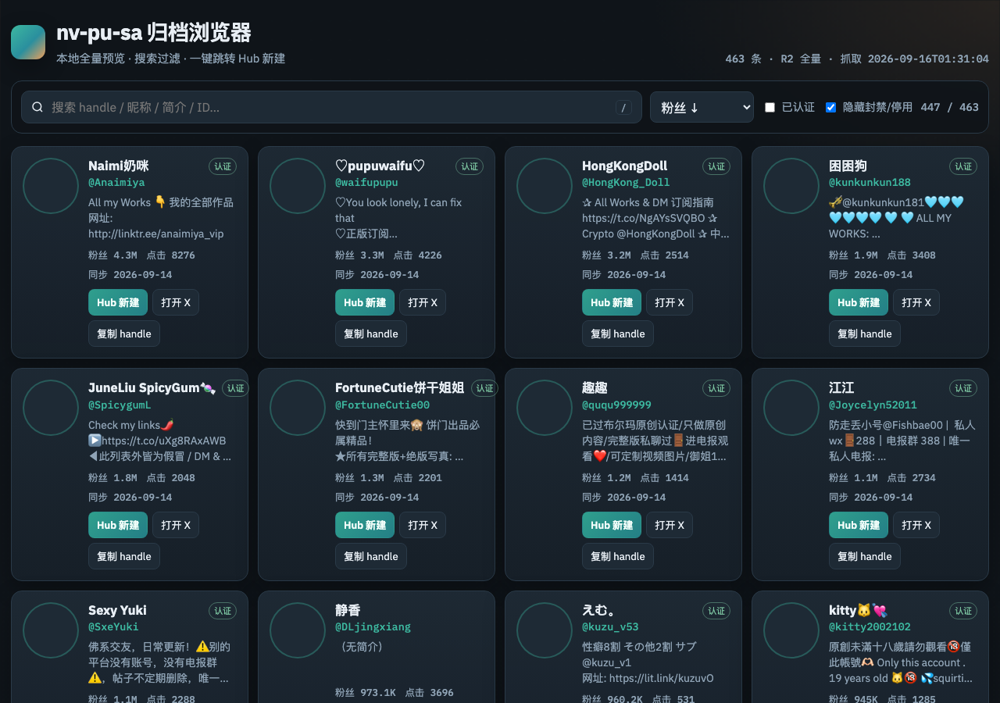
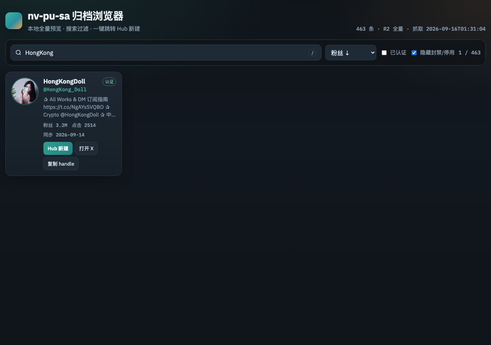

# 女菩萨 · 归档浏览器

[](./LICENSE)
[](#快速开始)
[](#数据来源)

本地优先的 **X（Twitter）博主全量归档浏览器**：从 [nv-pu-sa](https://nv-pu-sa.pages.dev/) 的 R2 公共数据拉取档案，支持搜索 / 过滤 / **收藏·备注·标签管理**，并可一键跳转到本机 [X Archive Hub](http://127.0.0.1:8770/) 新建账号。

<p align="center">
  
</p>

## 特性

- **全量预览**：头像、昵称、handle、简介、粉丝、点击、同步时间
- **快速检索**：`/` 聚焦搜索；支持昵称 / handle / 简介 / 标签 / 备注
- **本地管理**：收藏、备注、标签（localStorage）；导入 / 导出 JSON
- **Hub 联动**：`Hub 新建` → `http://127.0.0.1:8770/app/?tab=new&account={handle}`（自动去掉 `@`）
- **一键刷新数据**：`python3 scripts/fetch_archive.py` 从 R2 重拉 archive

## 快速开始

```bash
git clone git@github.com:wuxiumu/nv-pu-sa.git
cd nv-pu-sa
chmod +x scripts/serve.sh scripts/fetch_archive.py

# 启动静态预览（默认 8788）
./scripts/serve.sh
# 打开 http://127.0.0.1:8788/
```

或：

```bash
npm start
# / python3 -m http.server 8788 --bind 127.0.0.1
```

> 需要 HTTP 服务打开页面（`fetch` 读取 JSON），不要用 `file://`。

### 刷新全量数据

```bash
python3 scripts/fetch_archive.py
# 预览不写盘：
python3 scripts/fetch_archive.py --dry-run
```

流程：`runtime-config.json` → `r2_public_domain` → `{r2}/data/archive.json` → 生成 `data/archive.enriched.json`。

## 目录结构

```text
nv-pu-sa/
├── index.html              # 入口页
├── css/styles.css
├── js/
│   ├── app.js              # 预览 / 过滤 / Hub 跳转
│   └── store.js            # 收藏·备注·标签（localStorage）
├── config.json             # Hub 基址等默认配置
├── data/
│   ├── archive.json        # R2 原始全量
│   ├── archive.enriched.json
│   ├── meta.json
│   └── runtime-config.json
├── scripts/
│   ├── serve.sh
│   └── fetch_archive.py
└── docs/screenshots/
```

## 管理能力

| 能力 | 说明 |
|------|------|
| 收藏 | 卡片「☆ 收藏」；可「仅收藏」过滤 / 「收藏优先」排序 |
| 备注 / 标签 | 卡片「备注」；搜索会命中备注与标签 |
| Hub 基址 | 右上角「管理」可改，默认 `http://127.0.0.1:8770` |
| 导入导出 | 管理面板导出 / 导入 `nv-pu-sa-manager.json` |

管理数据只存在本机浏览器，**不上传**。

## Hub 新建跳转

```text
http://127.0.0.1:8770/app/?tab=new&account=Anaimiya
http://127.0.0.1:8770/app/?tab=new&account=Atmayn_   # 若带 @ 会去掉
```

需本机 Hub（8770）已启动。仓库本身只负责生成跳转链接，不依赖 Hub 代码。

## 数据来源

| 项 | 值 |
|----|----|
| 站点 | https://nv-pu-sa.pages.dev/ |
| runtime-config | `/runtime-config.json` → `r2_public_domain` |
| 主数据 | `{r2}/data/archive.json`（上次实测约 463 条） |

头像相对路径 `/api/media?key=avatars/...` 会解析为 R2 直链 `https://img.…/avatars/...`。

## 截图

| 首页 | 搜索 |
|------|------|
|  |  |

## License

MIT © wuxiumu
